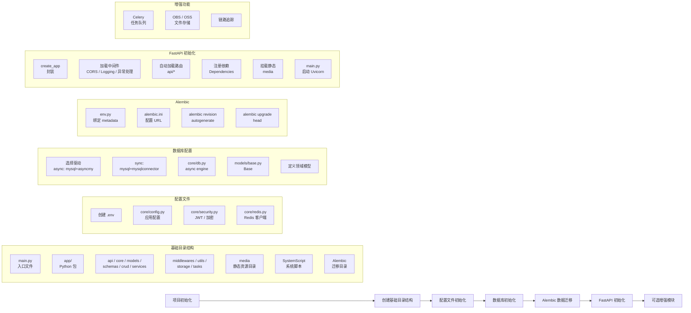

#### 项目创建流程

项目创建流程

```mermaid
graph LR

    A["项目初始化"] --> B["创建基础目录结构"]

    subgraph S1["基础目录结构"]
        B1["main.py<br/>入口文件"]
        B2["app/<br/>Python 包"]
        B3["api / core / models /<br/>schemas / crud / services"]
        B4["middlewares / utils /<br/>storage / tasks"]
        B5["media<br/>静态资源目录"]
        B6["SystemScript<br/>系统脚本"]
        B7["Alembic<br/>迁移目录"]
    end

    B --> C["配置文件初始化"]

    subgraph S2["配置文件"]
        C1["创建 .env"]
        C2["core/config.py<br/>应用配置"]
        C3["core/security.py<br/>JWT / 加密"]
        C4["core/redis.py<br/>Redis 客户端"]
    end

    C --> D["数据库初始化"]

    subgraph S3["数据库配置"]
        D1["选择驱动<br/>async: mysql+asyncmy"]
        D2["sync:<br/>mysql+mysqlconnector"]
        D3["core/db.py<br/>async engine"]
        D4["models/base.py<br/>Base"]
        D5["定义领域模型"]
    end

    D --> E["Alembic 数据迁移"]

    subgraph S4["Alembic"]
        E1["env.py<br/>绑定 metadata"]
        E2["alembic.ini<br/>配置 URL"]
        E3["alembic revision<br/>autogenerate"]
        E4["alembic upgrade<br/>head"]
    end

    E --> F["FastAPI 初始化"]

    subgraph S5["FastAPI 初始化"]
        F1["create_app<br/>封装"]
        F2["加载中间件<br/>CORS / Logging / 异常处理"]
        F3["自动加载路由<br/>api/*"]
        F4["注册依赖<br/>Dependencies"]
        F5["挂载静态<br/>media"]
        F6["main.py<br/>启动 Uvicorn"]
    end

    F --> G["可选增强模块"]

    subgraph S6["增强功能"]
        G1["Celery<br/>任务队列"]
        G2["OBS / OSS<br/>文件存储"]
        G3["链路追踪"]
    end
```

